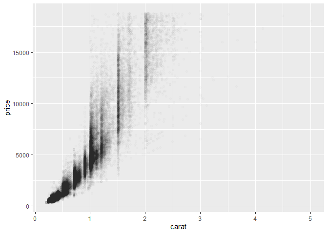

```r
library(tidyverse)
```

```
## -- Attaching packages --------------------------------------------------------- tidyverse 1.2.1 --
```

```
## v ggplot2 3.2.1     v purrr   0.3.2
## v tibble  2.1.3     v dplyr   0.8.3
## v tidyr   1.0.0     v stringr 1.4.0
## v readr   1.3.1     v forcats 0.4.0
```

```
## -- Conflicts ------------------------------------------------------------ tidyverse_conflicts() --
## x dplyr::filter() masks stats::filter()
## x dplyr::lag()    masks stats::lag()
```

```r
head(diamonds, 5)
```

```
## # A tibble: 5 x 10
##   carat cut     color clarity depth table price     x     y     z
##   <dbl> <ord>   <ord> <ord>   <dbl> <dbl> <int> <dbl> <dbl> <dbl>
## 1 0.23  Ideal   E     SI2      61.5    55   326  3.95  3.98  2.43
## 2 0.21  Premium E     SI1      59.8    61   326  3.89  3.84  2.31
## 3 0.23  Good    E     VS1      56.9    65   327  4.05  4.07  2.31
## 4 0.290 Premium I     VS2      62.4    58   334  4.2   4.23  2.63
## 5 0.31  Good    J     SI2      63.3    58   335  4.34  4.35  2.75
```

```r
diamonds %>% ggplot() +
  geom_point(aes(carat, price), alpha = 0.01)
```

<!-- -->

